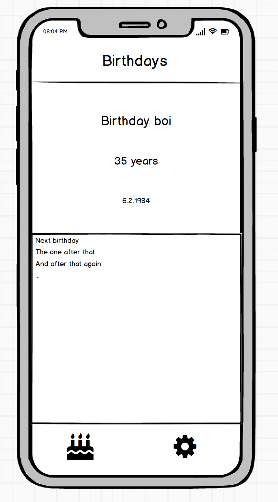

# xamarin-forms-birthday
Never miss a birthday again! This educational app was created as part of a Xamarin Forms course.

## Create new solution

Use `Blank Forms App` template. Update packages, build and run, it should work.

### Key takeaway

Know the difference between the different projects and understand how this can run on your phone.

## Show mock-up of the app to be created

{:height="677" width="376"}

### Key takeaway

Always mock-up your app before starting to code to avoid unecessary coding.

## Navigation and Tab bar

Delete the `MainPage`.

Create a new folder `Views`.

Add a new `MainPage` with XAML, inheriting from `ContenPage`. Change the inheritance to `TabbedPage`. The XAML should look like this:

```XAML
<?xml version="1.0" encoding="UTF-8"?>
<TabbedPage xmlns="http://xamarin.com/schemas/2014/forms" xmlns:x="http://schemas.microsoft.com/winfx/2009/xaml" xmlns:views="clr-namespace:Birthdays.Views" x:Class="Birthdays.Views.MainPage">
    <TabbedPage.Children>
        <NavigationPage Title="Birthdays">
            <x:Arguments>
                <views:BirthdaysPage />
            </x:Arguments>
        </NavigationPage>
        <NavigationPage Title="Settings">
            <x:Arguments>
                <views:SettingsPage />
            </x:Arguments>
        </NavigationPage>
    </TabbedPage.Children>
</TabbedPage>
```

Three problems now: 

1. MainPage has a new namespace
2. `BirthdaysPage` doesn't exist
3. `SettingsPage`doesn't exist

To fix this: 

1. Add `using Birthdays.Views;` to `App.xaml.cs`.
2. Create a `ContentPage` with XAML called `BirthdaysPage`.
3. Create a `ContentPage` with XAML called `SettingsPage`.

Build the app and run it.

### Key takeaway

Creating a skeleton of the app first makes it easier to add inn details later. XAML is used to describe the user interface in Xamarin Forms.

## Add titles to the new pages

Set the property `Title` of the two new `ContentPages`.

### Key takeaway

Navigation bars inherit the title of their active child. Each tab has its own navigation stack.

## Create a Grid for the Birthdays page

Create a simple grid consisting of two eqaul vertical parts like this:

```XAML
<ContentPage.Content>
    <Grid>
        <Grid.RowDefinitions>
            <RowDefinition Height="*" />
            <RowDefinition Height="*" />
        </Grid.RowDefinitions>
        <ContentView BackgroundColor="Red" />
        <ContentView Grid.Row="1" BackgroundColor="Green" />
    </Grid>
</ContentPage.Content>
```

### Key takeaway

Grid is an excellent way to lay out a small number of items on the screen. Verify your design using simple techniques before proceeding with details.

## Create view for closest birthday

Create a `ContentView` with XAML which will contain the closest birthday, `ClosestBirthdayView`:

```XAML
<ContentView.Content>
    <StackLayout>
        <Label HorizontalTextAlignment="Center" FontSize="24" VerticalOptions="Start" Margin="0,30,0,0" Text="Birthday Boi" />
        <Label HorizontalTextAlignment="Center" FontSize="32" VerticalOptions="CenterAndExpand" Text="35 years" />
        <Label HorizontalTextAlignment="Center" FontSize="24" VerticalOptions="End" Margin="0,0,0,30" Text="6.2.1984" />
    </StackLayout>
</ContentView.Content>
```

```XAML
xmlns:views="clr-namespace:Birthdays.Views"
...
<views:ClosestBirthdayView />
```

### Key takeway

Create small components to build up your UI. These must be referenced in XAML using the correct namespace. Know and utilize different layout options.

## Create all birthdays view

Create a `ContentView` with XAML which will show a list of all birthdays, `BirthdaysView`:

```XAML
<ContentView xmlns="http://xamarin.com/schemas/2014/forms" xmlns:x="http://schemas.microsoft.com/winfx/2009/xaml" x:Class="Birthdays.Views.BirthdaysView">
    <ContentView.Content>
        <ListView>
            <ListView.ItemsSource>
                <x:Array Type="{x:Type x:String}">
                    <x:String>Paul</x:String>
                    <x:String>Leto</x:String>
                    <x:String>Vladimir</x:String>
                    <x:String>Jessica</x:String>
                    <x:String>Duncan</x:String>
                </x:Array>
            </ListView.ItemsSource>
            <ListView.ItemTemplate>
                <DataTemplate>
                    <TextCell Text="{Binding}" Detail="Bursdag" />
                </DataTemplate>
            </ListView.ItemTemplate>
        </ListView>
    </ContentView.Content>
</ContentView>
```

### Key takeaway

A `ListView` is useful to show lists. `DataTemplates` defines the UI of items in lists or tables. `Bindings` sets vales in the UI based on other data.

## A short stylistic detour

Replace `Application.Resources` in `App.xaml` with:

```XAML
<Application.Resources>
    <ResourceDictionary>
        <Style TargetType="NavigationPage">
            <Setter Property="BarBackgroundColor" Value="#F9F9F9" />
        </Style>
    </ResourceDictionary>
</Application.Resources>
```

This will make the navigation bar be less ugly, at least on iOS.

### Key takeaway

Global styles are necessary and can be specified in `App.xaml`.